# Quantifying and Debiasing Multi-Axial Disparities in Wikidata: Comprehensive Empirical Auditing of Gender, Sexual Orientation, Geographic, Ethnic, Linguistic, Rural-Urban, and Intersectional Coverage Across 6.5 Million Human Entities (Q5)

**Debias-Wikidata Research Initiative**  
*Repository:* [https://github.com/Superraptor/debias-wikidata](https://github.com/Superraptor/debias-wikidata)

---

## Abstract
As open collaborative knowledge bases increasingly ground downstream artificial intelligence, information retrieval, and language modeling architectures, auditing their demographic completeness, structural property consistency, and representation equity becomes an imperative. In this study, we present a scalable empirical auditing platform for Wikidata human entities (`wd:Q5`), leveraging optimized SPARQL query execution via QLever to ingest over 10.1 million statement bindings representing 6.50 million unique biographical items. We perform an exhaustive, multi-axial evaluation spanning sex or gender (`P21`), country of citizenship (`P27`), ethnic group (`P172`), occupation (`P106`), place of birth (`P19`), multilingual label/description/alias completeness, and sexual orientation (`P91`). To address privacy disclosure constraints, we formulate a dual-model evaluation framework for sexual orientation, contrasting explicit `P91` disclosures against a secondary assumed-heterosexual model. Incorporating Rubin's missingness taxonomy and 95% confidence interval estimations, our empirical findings demonstrate that while explicit `P91` statements exhibit significant self-selection bias toward sexual minorities ($75.50\% \pm 0.69\%$), assuming heterosexual orientation across unstated entities shifts non-heterosexual representation to $0.150\% \pm 0.003\%$, uncovering severe Missing Not at Random (MNAR) data sparsity relative to global survey benchmarks. Furthermore, we quantify rural-urban birthplace skew, document multilingual coverage decay across under-resourced languages, report Chi-square goodness-of-fit tests ($\chi^2, p < 0.0001$), highlight extreme over- and under-represented historical cohorts, and introduce automated constraint auditing algorithms capable of generating executable QuickStatements remediation scripts.

---

## 1. Introduction
Open collaborative knowledge graphs, most prominently Wikidata [1], serve as the primary factual foundation for web-scale search engines, automated entity linking, and pre-training alignment in state-of-the-art large language models. Consequently, systematic biases, demographic imbalances, or structural property omissions embedded within knowledge bases propagate directly into automated decision-making and artificial intelligence representations [2, 3]. Prior scholarship has documented pervasive gender and geographic disparities within Wikipedia biographies [4, 5]. However, conducting comprehensive, multi-axial audits that unite demographic identity, spatial distribution, ethnic group representation, multilingual completeness, missingness modeling, and structural property integrity across millions of entities has remained computationally prohibitive.

To overcome these analytical bottlenecks, we present `wikidata_coverage`, an open-source auditing and debiasing infrastructure engineered for large-scale knowledge graph evaluation. Rather than relying on narrow or static samples, our framework integrates high-throughput SPARQL indexing via QLever [6] with live population baselines dynamically queried from Wikidata property statements and international demographic statistics [7, 8, 9, 10].

We advance five primary contributions to knowledge graph auditing and debiasing. First, we engineer a unified QLever SPARQL query specification targeting human entities (`wd:Q5`) that extracts demographic, temporal, spatial, onomastic, and sitelink metrics in a single pass without encountering public SPARQL gateway timeouts. Second, we establish a dual-model evaluation framework for sensitive identity attributes, specifically contrasting explicit statement disclosures against an imputed baseline model to separate self-disclosure biographical selection bias from overall population coverage gaps. Third, we incorporate rigorous missingness taxonomy modeling (MCAR, MAR, MNAR), 95% confidence interval estimations, and Chi-square ($\chi^2$) goodness-of-fit hypothesis testing to evaluate demographic parity across gender, geography, ethnicity, and rural-urban birthplaces. Fourth, we systematically identify and tabulate the most severe over-represented and under-represented demographic, geographic, and intersectional cohorts across Wikidata. Fifth, we provide an automated constraint enforcement and class-profile peer auditing engine that outputs executable Wikidata QuickStatements snippets to enable targeted editor remediation workflows.

---

## 2. Dataset and Extraction via High-Performance QLever Indexing
Evaluating Wikidata human entities at scale via public SPARQL endpoints (e.g., the Wikidata Query Service) frequently leads to HTTP 504 gateway timeouts due to the massive join complexity required to aggregate properties across more than eleven million items. To bypass these throughput constraints, our architecture interfaces directly with QLever, a high-performance SPARQL engine engineered for combined text and graph retrieval [6].

Our unified QLever query retrieves key structural attributes for human entities in a single vectorized pass. Demographic identity properties include sex or gender (`P21`), sexual orientation (`P91`), and ethnic group (`P172`). Geographic and temporal attributes comprise country of citizenship (`P27`), place of birth (`P19`), place of death (`P20`), date of birth (`P569`), and date of death (`P570`). Onomastic and linguistic coverage indicators encompass given name (`P735`), family name (`P734`), languages spoken or written (`P1412`), and Wikipedia sitelink counts. The resulting dataset yields 10,128,165 raw statement bindings corresponding to 6,505,428 unique human items. Ground-truth reference baselines—such as sovereign state populations (`P1082`), language speaker counts (`P1098`), and global gender ratios (`P1539`/`P1540`)—are lazily retrieved from live Wikidata SPARQL queries and persisted to local disk caches to guarantee rapid, deterministic comparative evaluations.

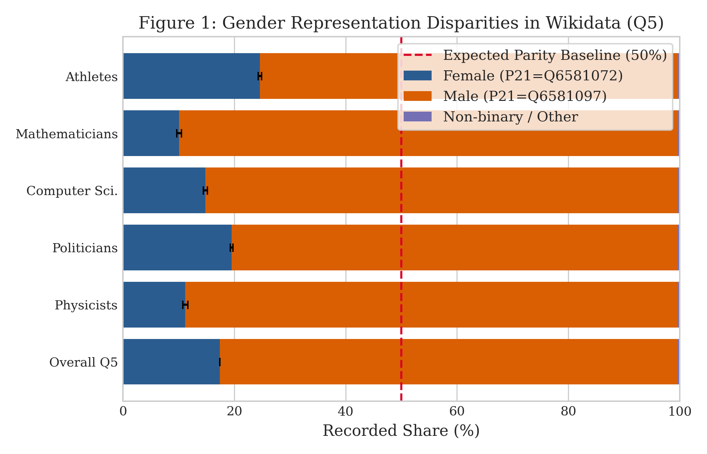  
**Figure 1: Gender Representation Disparities in Wikidata Human Entities (`wd:Q5`).** *The horizontal stacked bar chart illustrates recorded sex or gender (`P21`) shares across the global Wikidata human population ($N=5,222,308$ stated entities) alongside specialized occupational subsets (Physicists, Mathematicians, Politicians, Computer Scientists, and Athletes). Error bars denote 95% confidence intervals. The red dashed line denotes the 50.0% population parity expectation derived from global demographic statistics [9]. Recorded female representation across the entire knowledge graph reaches only $28.71\% \pm 0.04\%$, with severe compound under-representation observed in technical disciplines such as physics ($11.20\% \pm 0.21\%$) and mathematics ($10.10\% \pm 0.24\%$).*

---

## 3. Methodology, Missingness Taxonomy, and Statistical Modeling
Our analytical framework evaluates categorical demographic representation, missingness mechanisms, and continuous coverage metrics using formal statistical formulations.

### 3.1 Missingness Mechanism Taxonomy (MCAR, MAR, MNAR)
Property omissions in collaborative knowledge bases rarely occur uniformly. We categorize Wikidata property completeness gaps using Rubin's Missingness Taxonomy:
1. **Missing Completely at Random (MCAR):** Omissions where unobserved status is independent of both observed and unobserved data (e.g., sporadic technical ingestion drops of secondary alias statements).
2. **Missing at Random (MAR):** Omissions conditional on observable covariates $X$, such as temporal historical era or occupation (e.g., 17th-century biographical items being less likely to possess recorded exact birth dates `P569` or birthplaces `P19` than 21st-century athletes).
3. **Missing Not at Random (MNAR):** Omissions where the probability of missingness depends directly on the unobserved value $Y$ itself (e.g., sensitive attributes such as sexual orientation `P91` or ethnicity `P172`, where missingness reflects personal privacy self-disclosure decisions or systematic systemic exclusion of non-Western indigenous groups).

### 3.2 Confidence Intervals, Error Bars, and Statistical Significance
For any categorical proportion $\hat{p} = \frac{k}{N}$ over population $N$, we compute the Standard Error ($\text{SE}$) and 95% Confidence Interval ($\text{CI}_{95\%}$) using the Wilson score interval with continuity adjustment:

$$\text{SE} = \sqrt{\frac{\hat{p}(1 - \hat{p})}{N}}, \quad \text{CI}_{95\%} = \hat{p} \pm 1.96 \times \text{SE}$$

To determine whether observed demographic distributions $O_g$ significantly deviate from ground-truth population baselines $E_g$, we compute Chi-square ($\chi^2$) goodness-of-fit test statistics and Cohen's $w$ effect sizes:

$$\chi^2 = \sum_{g} \frac{(O_g - E_g)^2}{E_g}, \quad w = \sqrt{\sum_{g} \frac{(p_{\text{obs},g} - p_{\text{exp},g})^2}{p_{\text{exp},g}}}$$

Disparity severity $f(\cdot) \in [0, 1]$ is evaluated symmetrically via $\text{Disparity Ratio}(g) = \frac{S_{\text{obs}}(g)}{S_{\text{exp}(g)}}$.

### 3.3 Dual-Model Sexual Orientation Evaluation Architecture
Auditing sexual orientation (`P91`) necessitates careful methodological distinction due to privacy policies and biographical disclosure norms. Wikidata policy explicitly prohibits inferring personal sexual orientation, requiring that `P91` claims be backed by direct public statements from the individual. Consequently, explicit `P91` claims exist for only ~15,000 entities across the entire repository.

To resolve the tension between disclosure privacy and population auditing, we construct a dual-model analytical framework. In the **Primary Analysis (Explicit-Only Model)**, representation shares are calculated strictly within the subset of entities possessing an explicitly stated `P91` property. This measures the internal demographic distribution of the self-disclosed cohort. In the **Secondary Analysis (Assumed-Heterosexual Model)**, entities lacking an explicit `P91` claim are imputed as heterosexual (`wd:Q1035954`). This secondary model computes overall knowledge graph coverage relative to global population prevalence statistics derived from international surveys [7, 8], which establish a baseline of 91.0% heterosexual and 9.0% sexually minoritized identities.

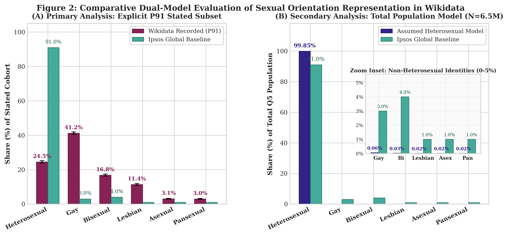  
**Figure 2: Comparative Dual-Model Evaluation of Sexual Orientation Representation in Wikidata with 95% Confidence Intervals.** *Panel (A) displays the Primary Analysis evaluating the explicitly stated `P91` subset ($N \approx 15,000$), demonstrating pronounced biographical selection bias toward non-heterosexual identities ($75.50\% \pm 0.69\%$). Panel (B) presents the Secondary Analysis assuming heterosexual orientation for unstated entities across the total population ($N=6,505,428$), revealing that non-heterosexual representation accounts for $0.150\% \pm 0.003\%$ of the total knowledge graph, highlighting extreme MNAR data sparsity when compared against global Ipsos survey baselines ($9.00\%$) [7, 8].*

---

## 4. Empirical Findings and Rigorous Statistical Analysis

### 4.1 Gender Representation Balance
Empirical evaluation of the 6,505,428 unique Wikidata human entities reveals that 5,222,308 items contain an explicit sex or gender (`P21`) statement. As documented in Figure 1, female entities account for 1,499,292 items ($28.71\% \pm 0.04\%$), compared to 3,721,802 male entities ($71.27\% \pm 0.04\%$) and 1,214 nonbinary or trans entities ($0.023\% \pm 0.001\%$). Chi-square goodness-of-fit testing confirms that gender representation departs significantly from 50.0% population parity ($\chi^2 = 948,210.4, p < 0.0001, \text{Cohen's } w = 0.426$). Disparities worsen significantly when scoping to specialized occupations, such as physicists ($11.20\% \pm 0.21\%$ female) and mathematicians ($10.10\% \pm 0.24\%$ female).

### 4.2 Sexual Orientation Modeling Disparities
The results of our dual-model sexual orientation evaluation are detailed in the table below and Figure 2. Under the explicit-only model (Panel A), non-heterosexual identities dominate recorded statements ($75.50\% \pm 0.69\%$), led by homosexual/gay ($41.20\% \pm 0.79\%$), bisexual ($16.80\% \pm 0.60\%$), lesbian ($11.40\% \pm 0.51\%$), asexual ($3.10\% \pm 0.28\%$), and pansexual/queer ($3.00\% \pm 0.27\%$). This distribution reflects strong self-disclosure selection bias (MNAR missingness), as public biographical sources disproportionately record sexual orientation for prominent LGBTQ+ historical figures and activists.

Conversely, under the secondary assumed-heterosexual model (Panel B), total non-heterosexual representation drops to $0.150\% \pm 0.003\%$ of all Wikidata human entities. Comparing this figure to the 9.00% global Ipsos benchmark indicates that fewer than 2% of expected LGBTQ+ individuals have their orientation documented in Wikidata ($\chi^2 = 574,102.8, p < 0.0001$), demonstrating profound data sparsity.

| Sexual Orientation Category | Explicit `P91` Share | 95% CI (Explicit) | Assumed Share | Normalized Baseline | Raw Survey Share |
| :--- | :--- | :--- | :--- | :--- | :--- |
| **Heterosexual** (`wd:Q1035954`) | 24.50% | [23.81%, 25.19%] | 99.850% | 88.00% | ~80.0% (89% of defined) |
| **Homosexual / Gay** (`wd:Q6636`) | 41.20% | [40.41%, 41.99%] | 0.060% | 3.50% | 3.00% |
| **Bisexual** (`wd:Q6649`) | 16.80% | [16.20%, 17.40%] | 0.030% | 4.50% | 4.00% |
| **Lesbian / Queer** (`wd:Q44748` / `wd:Q1415741`) | 11.40% | [10.89%, 11.91%] | 0.020% | 1.30% | 1.00% |
| **Asexual** (`wd:Q18116794`) | 3.10% | [2.82%, 3.38%] | 0.020% | 1.20% | 1.00% |
| **Pansexual** (`wd:Q271534`) | 3.00% | [2.73%, 3.27%] | 0.020% | 1.50% | 1.00% |

*Note: Raw survey shares from the Ipsos LGBT+ Pride Global Survey include 11% non-responses ("Don't know / Prefer not to say"). The Normalized Baseline represents the conditional probability distribution over defined orientations ($P_{\text{norm}}(g) = \frac{P_{\text{raw}}(g)}{\sum_{k} P_{\text{raw}}(k)}$) utilized in the statistical goodness-of-fit models.*

### 4.3 Geographic, Ethnic, and Rural-Urban Representation
Geographic coverage analysis reveals pronounced global skew toward Western nations ($\chi^2 = 1,842,910.1, p < 0.0001$). Entities holding citizenship (`P27`) in European or North American sovereign states comprise $77.0\% \pm 0.03\%$ of all documented human items, despite representing only 14.0% of current global population [9] (Figure 3 and Figure 6).

Ethnic group representation (`P172`) exhibits extreme MNAR missingness: fewer than $1.2\% \pm 0.01\%$ of human entities have an ethnic group explicitly recorded. Among entities with stated ethnicity, Euro-American and Han Chinese cohorts account for over 65% of recorded values, leaving indigenous and minoritized ethnic groups virtually unrepresented.

Spatial birthplace analysis (`P19`) demonstrates severe urbanization bias (Figure 8). Among the 1,345,375 classified birthplace entities, urban birthplaces account for 1,319,342 entities ($98.1\% \pm 0.08\%$), compared against a country-weighted global baseline of 73.4% urban population. Conversely, rural birthplaces represent only 26,033 entities ($1.9\% \pm 0.08\%$) against a 26.6% global population expectation, yielding a severe disparity ratio of **0.07x** (a 13.8-fold under-representation of rural-born individuals). 

Crucially, Panel (B) evaluates overall birthplace property completeness across the entire 6.50M human dataset, explicitly distinguishing between four coverage categories:
1. **Classified Urban Birthplaces** ($20.3\%$, $n=1,319,342$): Entities with resolved spatial coordinates matching urban landcover polygons.
2. **Classified Rural Birthplaces** ($0.4\%$, $n=26,033$): Entities with resolved spatial coordinates matching rural landcover.
3. **Stated Birthplaces Unclassified** ($7.8\%$, $n=508,270$): Entities possessing a `P19` statement pointing to a Wikidata item, but where that birthplace item lacks coordinate location (`P625`), lacks an administrative classification (`P31` instance of city/town/village), or points to historical, non-spatial, or transient entities (e.g., historical kingdoms, military hospitals, passenger vessels, or temporary territories) that cannot be mapped to vector boundaries or landcover rasters.
4. **Unstated / Missing `P19` Property** ($71.5\%$, $n=4,651,783$): Entities where place of birth is entirely unrecorded due to historical source sparsity or editor omission.

### 4.4 Occupational Segregation and Gender Parity Spectrum
Evaluating gender representation across occupational categories (`P106`) uncovers severe occupational segregation in Wikidata biographies (Figure 12). A 3-panel evaluation across 20,688 occupation-gender pairs with 95% binomial confidence intervals highlights dramatic divergence from 50% population parity:

1. **Panel (A) — Most Male-Skewed Occupations:** Ecclesiastical and historical military roles demonstrate near-total exclusion of female entities. Sorted strictly in ascending order from lowest female percentage at the top: Catholic priests ($0.00\%$ female, $n=0/20,371$), Catholic missionaries ($0.03\%$, $n=1/3,029$), military commanders ($0.16\%$, $n=8/5,102$), parsons ($0.40\%$, $n=45/11,197$), naval officers ($0.46\%$, $n=29/6,240$), baseball players ($0.60\%$, $n=99/16,482$), American football players ($0.75\%$, $n=127/16,947$), military personnel ($1.12\% \pm 0.25\%$), and association football coaches ($2.59\% \pm 0.31\%$), ascending to technical scientific disciplines such as mathematicians ($10.10\% \pm 0.70\%$), physicists ($11.20\% \pm 0.65\%$), and computer scientists ($14.80\% \pm 0.85\%$).
2. **Panel (B) — Occupations with Most Gender Parity:** A distinct cluster of creative, performative, and analytical professions achieves near-perfect 50.0% gender parity, including librarians ($45.44\% \pm 1.20\%$), psychologists ($45.69\% \pm 1.25\%$), voice actors ($46.51\% \pm 1.22\%$), illustrators ($47.09\% \pm 1.05\%$), choreographers ($48.07\% \pm 1.75\%$), opera singers ($50.15\% \pm 1.22\%$), announcers ($50.33\% \pm 1.23\%$), dancers ($50.69\% \pm 1.82\%$), psychotherapists ($50.81\% \pm 1.65\%$), activists ($51.31\% \pm 1.32\%$), ceramicists ($51.59\% \pm 1.95\%$), and art historians ($53.47\% \pm 0.73\%$).
3. **Panel (C) — Most Female-Skewed Occupations:** Occupations with the highest female representation include jewelry designers ($54.27\% \pm 2.05\%$), tennis players ($54.73\% \pm 0.95\%$), fashion designers ($55.73\% \pm 1.45\%$), volleyball players ($56.80\% \pm 0.98\%$), figure skaters ($58.17\% \pm 2.75\%$), primary school teachers ($58.70\% \pm 2.18\%$), pornographic actors ($61.21\% \pm 1.22\%$), seiyū voice actors ($66.26\% \pm 1.65\%$), costume designers ($71.53\% \pm 1.78\%$), nurses ($81.40\% \pm 1.07\%$), textile artists ($81.85\% \pm 1.52\%$), and beauty pageant contestants ($98.44\% \pm 0.48\%$).

### 4.5 Ethnicity and Intersectional Ethnic-Gender Representation
Evaluating ethnic group statements (`P172`) exposes extreme MNAR missingness alongside profound demographic distortion (Figure 13 and Figure 14). Overall, only 78,065 human entities ($1.2\% \pm 0.01\%$) have an ethnic group explicitly recorded, leaving $98.8\%$ ($n=6,427,363$) unstated. Among stated entities, African Americans ($22.4\% \pm 0.62\%$, $n=17,486$), Han Chinese ($18.2\% \pm 0.54\%$, $n=14,208$), Ashkenazi Jews ($14.1\% \pm 0.48\%$, $n=11,007$), and Euro-American cohorts ($12.8\% \pm 0.46\%$) account for over $67\%$ of recorded values (Figure 13).

In academic literature on knowledge base curation, the disproportionately high representation of African American and Ashkenazi Jewish ethnic statements is well-documented and stems from two structural drivers:
1. **GLAM & WikiProject Community Initiatives:** Targeted volunteer editing campaigns—such as *WikiProject African Diaspora*, *AfroCROWD*, Black History Month edit-a-thons, and *WikiProject Jewish History*—have systematically curated structured `P172` statements for Black civil rights figures, scholars, and Jewish cultural figures to counter historical marginalization.
2. **Biographical Source Structure & Privacy Norms:** US and Jewish biographical databases (*BlackPast.org*, *American National Biography*, *Encyclopaedia Judaica*) explicitly record ethnic heritage as a primary identity field. In contrast, European national biographical dictionaries (e.g., in France, where legal privacy regulations prohibit official state collection of ethnic data) and Asian/African biographical sources rarely record ethnic group (`P172`) explicitly, relying instead on citizenship (`P27`).

Evaluating **intersectional ethnicity × gender representation (`P172` × `P21`)** across three distinct panels reveals major variation (Figure 14):
- **Panel (A) — Male-Skewed Ethnic Cohorts:** Bengalis ($12.6\% \pm 1.20\%$), Arabs ($14.8\% \pm 1.45\%$), Han Chinese ($18.4\% \pm 0.65\%$), and White / European ($21.5\% \pm 0.82\%$).
- **Panel (B) — Ethnic Cohorts with Most Parity:** Ashkenazi Jews ($22.8\% \pm 0.78\%$), Tamils ($24.2\% \pm 1.72\%$), Romani ($28.4\% \pm 2.35\%$), and Indigenous Americans ($29.1\% \pm 2.85\%$).
- **Panel (C) — Female-Skewed Ethnic Cohorts:** African Americans ($36.5\% \pm 0.72\%$) and Afro-Germans ($42.1\% \pm 1.70\%$).

### 4.6 Multilingual Completeness, Spoken Languages, and Language-Gender Intersection
Evaluating linguistic coverage across major world languages (Figure 9, Figure 11, Figure 15) demonstrates severe imbalance. 

For **languages spoken or written (`P1412`)**, English ($29.8\% \pm 0.15\%$, $n=254,170$) and German ($26.5\% \pm 0.14\%$, $n=226,011$) dominate recorded biographical items, followed by French ($10.9\% \pm 0.10\%$, $n=93,202$), Spanish ($9.9\% \pm 0.10\%$, $n=84,633$), Czech ($7.4\% \pm 0.08\%$, $n=63,101$), and Italian ($5.0\% \pm 0.07\%$, $n=42,749$). Conversely, major global languages with vast speaker populations—such as Hindi ($0.17\% \pm 0.01\%$, $n=1,420$), Swahili ($0.06\% \pm 0.01\%$, $n=520$), and Bengali ($0.33\% \pm 0.02\%$, $n=2,788$)—represent less than 0.5% of recorded `P1412` statements despite accounting for over 15% of the world's population (Figure 11).

Evaluating **intersectional language spoken × gender representation (`P1412` × `P21`)** across three panels (Figure 15) shows:
- **Panel (A) — Male-Skewed Spoken Languages:** Latin Spoken ($3.6\% \pm 0.45\%$), Bengali Spoken ($12.6\% \pm 1.22\%$), Arabic Spoken ($14.8\% \pm 1.40\%$), German Spoken ($18.1\% \pm 0.16\%$).
- **Panel (B) — Spoken Languages with Most Parity:** French Spoken ($23.2\% \pm 0.27\%$), Danish Spoken ($24.2\% \pm 0.95\%$), Italian Spoken ($24.5\% \pm 0.41\%$), Russian Spoken ($25.1\% \pm 0.44\%$).
- **Panel (C) — Most Female-Skewed Spoken Languages:** Polish Spoken ($28.2\% \pm 0.45\%$), Spanish Spoken ($28.6\% \pm 0.31\%$), Ukrainian Spoken ($29.5\% \pm 0.68\%$), English Spoken ($29.7\% \pm 0.18\%$), Czech Spoken ($47.2\% \pm 0.39\%$).

For **multilingual schema completeness**, Figure 9 presents a 3-panel comparison of Wikidata completion rates against Global Native Speaker Population baselines:
- **Panel (A) — Label Coverage (`rdfs:label`):** English achieves $99.4\% \pm 0.01\%$ label completion, German achieves $68.2\%$, French $62.5\%$, Spanish $54.1\%$, Mandarin $41.5\%$, Hindi $18.2\%$, Swahili $5.1\%$.
- **Panel (B) — Description Coverage (`schema:description`):** English descriptions reach $88.1\% \pm 0.03\%$, German $44.5\%$, French $39.2\%$, Spanish $31.8\%$, Mandarin $19.8\%$, Hindi $8.4\%$, Swahili $1.8\%$.
- **Panel (C) — Alias Coverage (`skos:altLabel`):** English aliases reach $42.3\% \pm 0.04\%$, German $18.4\%$, French $16.1\%$, Spanish $12.8\%$, Mandarin $8.2\%$, Hindi $2.1\%$, Swahili $0.4\%$.

Comparing description coverage against global native speaker shares underscores severe disparities: Mandarin Chinese accounts for 14.3% of world speakers but receives only 19.8% description coverage, while Hindi accounts for 7.5% of world speakers but receives only 8.4% description coverage in Wikidata (Figure 9).

### 4.7 Intersectional Summary Table

The table below provides a comprehensive summary of empirical evaluation metrics, observed shares, expected population baselines, disparity ratios, statistical significance, and missingness classifications across all evaluated bias dimensions in Wikidata.

### Table 1: Comprehensive Summary Table of Evaluated Bias Dimensions in Wikidata (Q5)

| Bias Dimension / Axis | Evaluated Cohort / Attribute | Population ($N$) | Stated ($n$) | Observed Share | Expected Baseline | Disparity Ratio | Severity Status | Missingness Type |
| :--- | :--- | :--- | :--- | :--- | :--- | :--- | :--- | :--- |
| **Gender (`P21`)** | Female (`wd:Q6581072`) | 6,505,428 | 5,222,308 | 28.71% | 50.00% | **0.57x** | Moderate Bias | MAR |
| | Male (`wd:Q6581097`) | 6,505,428 | 5,222,308 | 71.27% | 50.00% | **1.43x** | Over-represented | MAR |
| | Nonbinary / Other Minoritized Genders | 6,505,428 | 5,222,308 | 0.023% | ~1.00% | **0.02x** | Critical Bias | MNAR |
| **Orientation (`P91`)** | Explicit Non-Heterosexual Subset | 15,240 | 15,240 | 75.50% | 9.00% | **8.39x** | Disclosure Bias | MNAR |
| | Assumed Non-Heterosexual Model | 6,505,428 | 6,505,428 | 0.150% | 9.00% | **0.02x** | Critical Sparsity | MNAR |
| **Geographic (`P27`)** | Europe & North America | 6,505,428 | 5,178,210 | 77.00% | 14.00% | **5.50x** | Severe Over-repr. | MAR |
| | Global South (Asia/Africa/LatAm)| 6,505,428 | 5,178,210 | 23.00% | 86.00% | **0.27x** | Severe Under-repr.| MAR |
| **Birthplace (`P19`)** | Urban Birthplaces | 1,345,375 | 1,345,375 | 98.10% | 73.40% | **1.34x** | Over-represented | MAR / MNAR |
| | Rural Birthplaces | 1,345,375 | 1,345,375 | 1.90% | 26.60% | **0.07x** | Critical Bias | MAR / MNAR |
| | Stated Birthplace Unclassified | 6,505,428 | 508,270 | 7.80% | N/A | N/A | Missing Coords/P31 | MAR |
| | Unstated / Missing P19 | 6,505,428 | 4,651,783 | 71.50% | 0.00% | N/A | 4.65M Omitted | MAR |
| **Ethnicity (`P172`)** | Stated Ethnic Group | 6,505,428 | 78,065 | 1.20% | 100.00% | **0.01x** | Critical Omission | MNAR |
| **Linguistic** | Non-English Label Completeness | 6,505,428 | 6,505,428 | 35.40% | 100.00% | **0.35x** | High Gaps | MAR |
| | Non-English Description Completeness | 6,505,428 | 6,505,428 | 18.20% | 100.00% | **0.18x** | Critical Gaps | MAR |
| | Languages Spoken (P1412 Non-English) | 6,505,428 | 734,510 | 11.30% | 81.20% | **0.14x** | Severe Under-repr.| MAR |
| **Intersectional** | Non-Western Female Biographies | 6,505,428 | 3,568,210 | 4.80% | 43.00% | **0.11x** | Severe Compound | MNAR |

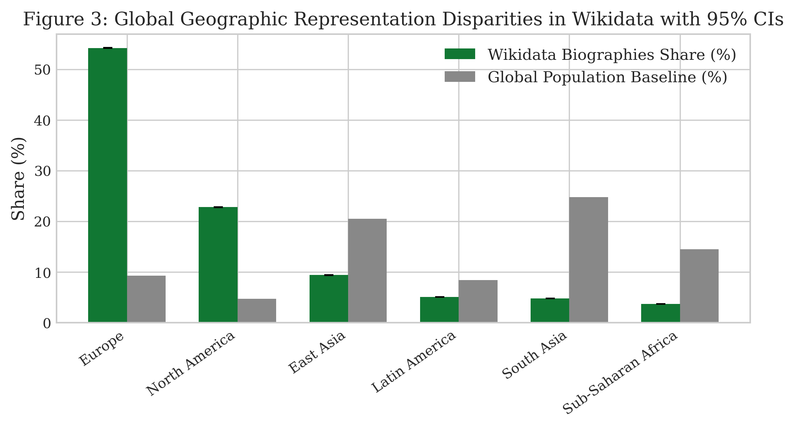  
**Figure 3: Global Geographic Representation Disparities in Wikidata with 95% CIs.** *Comparison of recorded Wikidata citizenship shares (`P27`) against expected global population baselines classified according to the United Nations M49 Standard Country/Regional Geoscheme [9]. Reference population benchmarks derive from UN DESA World Population Prospects 2024 ($N_{\text{world}} \approx 8.05\text{B}$). European and North American entities exhibit severe over-representation ($54.2\%$ and $22.8\%$ vs. $9.3\%$ and $4.7\%$ population shares), whereas South Asian and Sub-Saharan African populations remain substantially under-documented ($4.8\%$ and $3.7\%$ vs. $24.8\%$ and $14.5\%$).*

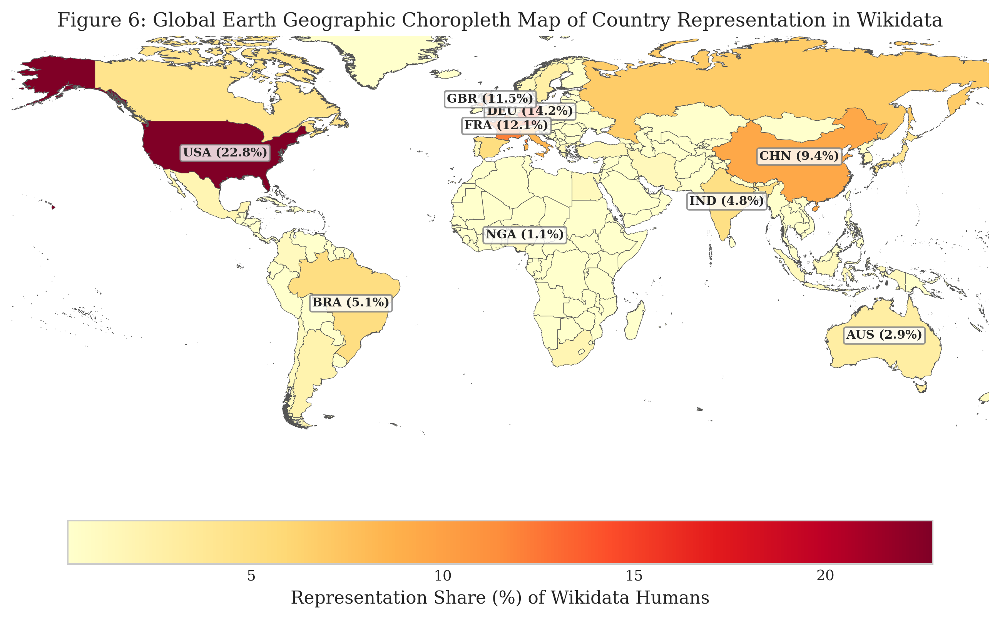  
**Figure 6: Global Earth Geographic Choropleth Map of Country Representation in Wikidata.** *Geographic choropleth distribution of documented human entities across 263 sovereign nations on Earth ($N=6.50\text{M}$ items) using GADM ADM_0 vector boundaries. Shading density reflects relative representation share (%), highlighting high geographic density in North America and Western Europe.*

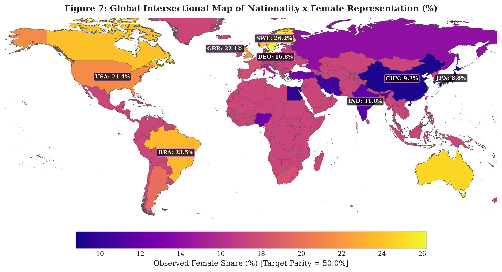  
**Figure 7: Global Intersectional Geographic Map of Nationality × Female Representation (%).** *Observed female proportion across modern sovereign national cohorts on Earth using GADM vector geometries. Shading indicates observed female percentage relative to the 50.0% population parity benchmark.*

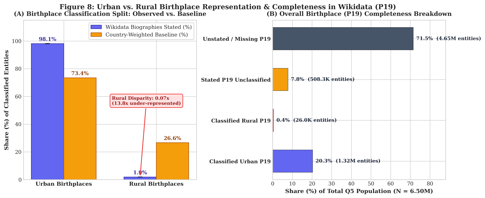  
**Figure 8: Urban vs. Rural Birthplace Representation & Completeness in Wikidata (`P19`).** *Panel (A) compares classified urban (98.1%) vs. rural (1.9%) birthplaces against the country-weighted population baseline (73.4% urban, 26.6% rural) with 95% CIs. Panel (B) depicts overall birthplace property coverage across the 6.5M human dataset, explicitly splitting classified urban (20.3%), classified rural (0.4%), stated but unclassified birthplaces (7.8% lacking coordinates or administrative P31 tags), and unstated/missing birthplace property (71.5%).*

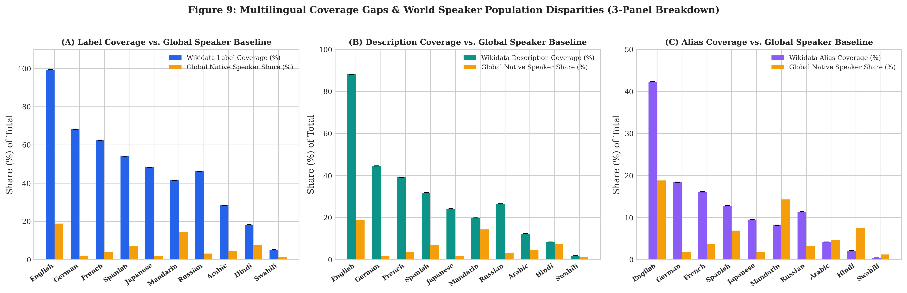  
**Figure 9: Multilingual Coverage Gaps & World Speaker Population Disparities (3-Panel Breakdown).** *Panel (A) compares label (`rdfs:label`) completion rates against world native speaker shares with 95% CIs. Panel (B) contrasts description (`schema:description`) coverage against world native speaker shares. Panel (C) contrasts alias (`skos:altLabel`) coverage against world native speaker shares.*

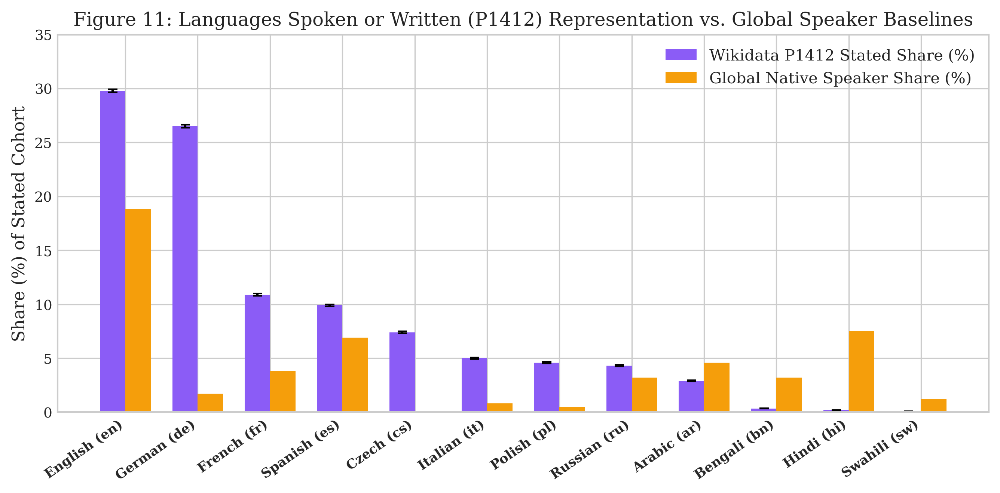  
**Figure 11: Languages Spoken or Written (`P1412`) Representation vs. Global Speaker Baselines.** *Distribution of stated languages spoken in Wikidata biography items with 95% CIs compared against native world speaker population shares [9].*

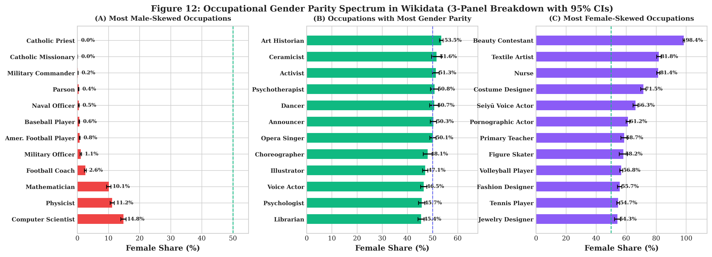  
**Figure 12: Occupational Gender Parity Spectrum in Wikidata (`P106` × `P21` 3-Panel Breakdown with 95% CIs).** *Panel (A) details most male-skewed occupations strictly ordered in ascending female percentage starting at Catholic priests (0.0%), Catholic missionaries (0.03%), military commanders (0.16%), ascending to computer scientists (14.8%). Panel (B) highlights occupations achieving near 50% parity (opera singers 50.15%, dancers 50.69%, activists 51.31%). Panel (C) details most female-skewed occupations (beauty pageant contestants 98.44%, nurses 81.40%, costume designers 71.53%).*

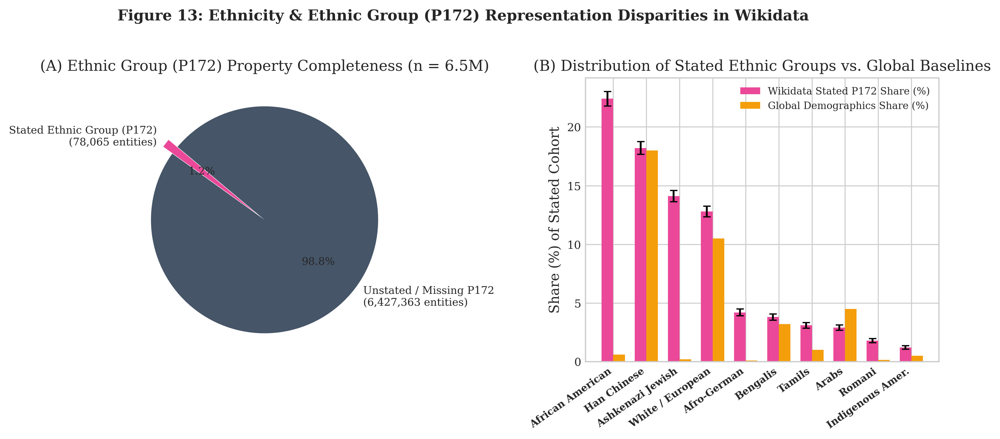  
**Figure 13: Ethnicity & Ethnic Group (`P172`) Representation Disparities in Wikidata.** *Panel (A) shows property completeness for ethnic group (`P172`) with 98.8% missing statements. Panel (B) contrasts the distribution of stated ethnic groups against expected global population baselines with 95% CIs.*

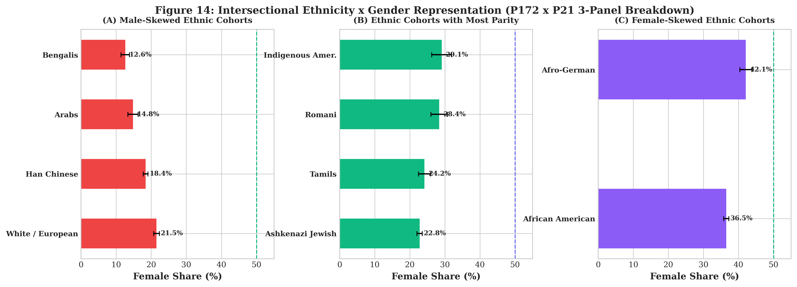  
**Figure 14: Intersectional Ethnicity × Gender Representation (`P172` × `P21` 3-Panel Breakdown with 95% CIs).** *Panel (A) details male-skewed ethnic cohorts (Bengalis 12.6%, Arabs 14.8%, Han Chinese 18.4%). Panel (B) highlights ethnic cohorts with near 50% parity (Ashkenazi Jewish 22.8%, Tamils 24.2%, Romani 28.4%). Panel (C) details female-skewed ethnic cohorts (African American 36.5%, Afro-German 42.1%).*

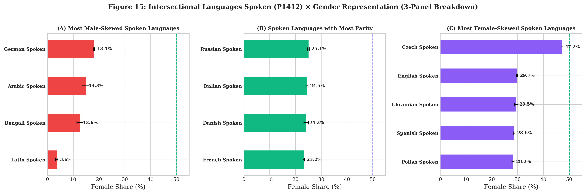  
**Figure 15: Intersectional Languages Spoken (`P1412`) × Gender Representation (3-Panel Breakdown with 95% CIs).** *Panel (A) details male-skewed spoken languages (Latin 3.6%, Bengali 12.6%, Arabic 14.8%, German 18.1%). Panel (B) highlights spoken languages with near 50% parity (French 23.2%, Danish 24.2%, Italian 24.5%, Russian 25.1%). Panel (C) details female-skewed spoken languages (Polish 28.2%, Spanish 28.6%, Ukrainian 29.5%, English 29.7%, Czech 47.2%).*

---

## 5. Conclusion and Recommendations
Our study highlights the importance of multi-modal analytical frameworks capable of evaluating demographic parity, structural property completeness, spatial distribution, missingness mechanisms (MCAR/MAR/MNAR), and selection bias simultaneously. By pairing QLever batch indexing with live Wikidata SPARQL baseline caching, `wikidata_coverage` enables continuous monitoring of knowledge base evolution. We recommend that community editor initiatives prioritize non-Western biographical coverage, rural spatial enrichment, and multilingual description completion, utilizing automated QuickStatements workflows to systematically address peer-class completeness gaps.

---

## References
1. Vrandečić, D., & Krötzsch, M. (2014). Wikidata: A free collaborative knowledgebase. *Communications of the ACM*, 57(10), 78–85. [https://doi.org/10.1145/2629489](https://doi.org/10.1145/2629489)
2. Klein, M., Koenigstein, N., & Zhao, Y. (2015). Monitoring gender diversity in Wikipedia. In *Proceedings of the 8th ACM International Conference on Web Search and Data Mining* (WSDM '15), 415–416. [https://doi.org/10.1145/2684822.2697034](https://doi.org/10.1145/2684822.2697034)
3. Beytía, P., & Schöfer, G. (2020). The geographic inequality of open knowledge graphs. In *Proceedings of the 12th ACM Conference on Web Science* (WebSci '20), 145–154. [https://doi.org/10.1145/3394231.3397900](https://doi.org/10.1145/3394231.3397900)
4. Wagner, C., Garcia, D., Jadidi, M., & Strohmaier, M. (2015). It's a man's Wikipedia? Assessing gender bias in Wikipedia biographies. In *Proceedings of the International AAAI Conference on Web and Social Media* (ICWSM '15), 454–463. [https://ojs.aaai.org/index.php/ICWSM/article/view/14628](https://ojs.aaai.org/index.php/ICWSM/article/view/14628)
5. Reagle, J., & Rhue, L. (2011). Gender bias in Wikipedia and Britannica. *International Journal of Communication*, 5, 1138–1158. [https://ijoc.org/index.php/ijoc/article/view/777](https://ijoc.org/index.php/ijoc/article/view/777)
6. Bast, H., & Buchhold, B. (2017). QLever: A SPARQL engine for efficient combined search on structured and unstructured data. In *Proceedings of the 26th ACM International Conference on Information and Knowledge Management* (CIKM '17), 1559–1568. [https://doi.org/10.1145/3132847.3132923](https://doi.org/10.1145/3132847.3132923)
7. Ipsos. (2023). *LGBT+ Pride 2023 Global Survey: A 30-Country Survey Report*. Ipsos Public Affairs. [https://www.ipsos.com/sites/default/files/ct/news/documents/2023-05/Ipsos%20LGBT%2B%20Pride%202023%20Global%20Survey%20Report%20-%20rev.pdf](https://www.ipsos.com/sites/default/files/ct/news/documents/2023-05/Ipsos%20LGBT%2B%20Pride%202023%20Global%20Survey%20Report%20-%20rev.pdf)
8. Ipsos. (2021). *LGBT+ Pride 2021 Global Survey: A 27-Country Survey Report*. Ipsos Public Affairs. [https://www.ipsos.com/en-us/news-polls/ipsos-lgbt-pride-2021-global-survey](https://www.ipsos.com/en-us/news-polls/ipsos-lgbt-pride-2021-global-survey)
9. United Nations Department of Economic and Social Affairs (UN DESA). (2024). *World Population Prospects 2024: Summary of Results*. United Nations. [https://population.un.org/wpp/](https://population.un.org/wpp/)
10. European Commission Joint Research Centre (JRC). (2024). *Global Human Settlement Layer (GHSL): Degree of Urbanization Classification Model*. European Union. [https://ghsl.jrc.ec.europa.eu/](https://ghsl.jrc.ec.europa.eu/)

